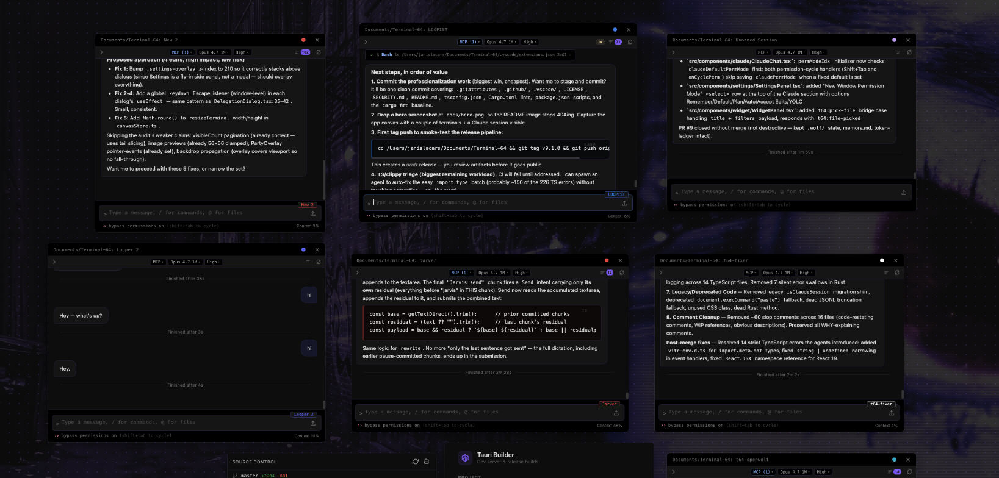

<div align="center">

# Terminal 64

**A canvas-based terminal emulator and AI workstation — run terminals, Claude Code agents, widgets, and more on an infinite pan/zoom canvas.**

[](https://github.com/Pugbread/Terminal-64/actions)
[](https://github.com/Pugbread/Terminal-64/releases)
[](#license)
[](https://tauri.app/)
[](https://react.dev/)
[](#install)



</div>

---

## Features

- **Terminals** — multi-session PTYs (xterm.js + WebGL) on a free-form pan/zoom canvas with snap guides, pop-out windows, activity indicators, and session persistence.
- **Claude Code sessions** — streaming chat UI, Monaco diff overlay, file tree, rewind/fork history, loop mode, and inline permission handling.
- **MCP servers** — live Model Context Protocol status and configuration per session.
- **Multi-agent delegation** — `/delegate` splits work across parallel Claude agents with shared team chat and auto-merge back into the parent session.
- **Widgets** — build HTML/CSS/JS panels with a 40+ command `postMessage` bridge (shell, filesystem, terminals, Claude sessions, browser, pub/sub, persistent state) plus hot reload.
- **Skills** — reusable Claude instruction sets stored in `~/.terminal64/skills/`, spawned with the target project as CWD.
- **Party mode** — system audio capture → FFT → audio-reactive equalizer bars, edge glow, and theme-locked or rainbow color cycling.
- **Browser panels** — embedded native webviews positioned on the canvas with URL bar and navigation controls.
- **Discord bot** — optional session ↔ channel sync for remote access.
- **Command palette, quick pastes, AI prompt rewriter, 8 built-in themes, AI-generated Quick Theme.**

## Install

Prebuilt binaries are published on the [Releases](https://github.com/Pugbread/Terminal-64/releases) page.

| Platform | Download |
|---|---|
| macOS (Apple Silicon / Intel) | [`.dmg`](https://github.com/Pugbread/Terminal-64/releases/latest) |
| Linux (x86_64) | [`.AppImage`](https://github.com/Pugbread/Terminal-64/releases/latest) |
| Windows (x86_64) | [`.msi`](https://github.com/Pugbread/Terminal-64/releases/latest) |

> Unsigned builds may require you to bypass OS gatekeepers on first launch (e.g. right-click → Open on macOS).

## Dev Setup

### Prerequisites

- [Rust](https://rustup.rs/) stable `1.77.2+`
- [Node.js](https://nodejs.org/) `v18+`
- **macOS**: Xcode Command Line Tools (`xcode-select --install`)
- **Windows**: Visual Studio Build Tools with C++ workload
- **Linux**: standard Tauri v2 deps (`webkit2gtk-4.1`, `libayatana-appindicator`, etc. — see [Tauri prerequisites](https://tauri.app/start/prerequisites/))

### Run

```bash
git clone https://github.com/Pugbread/Terminal-64.git
cd Terminal-64
npm install
npm run tauri dev
```

### Production build

```bash
npm run tauri build
```

Outputs a native executable and platform installer under `src-tauri/target/release/bundle/`.

## Architecture

Terminal 64 is a Tauri v2 desktop app: a **Rust backend** (`src-tauri/src/`) manages PTYs, the Claude CLI subprocess, the Discord bot, MCP permission server, audio capture, widget HTTP server, and native browser children; a **React 19 + TypeScript frontend** (`src/`) renders the canvas, xterm.js terminals, Claude chat, Monaco overlays, widgets, and party-mode visuals. Communication flows via Tauri IPC (`invoke` + event emitters), with Zustand stores providing persisted client state. For a full module-by-module breakdown — PTY lifecycle, Claude stream-json parsing, delegation orchestration, widget bridge, party-mode audio pipeline, design conventions, and user-data paths — see [CLAUDE.md](CLAUDE.md).

## Keyboard Shortcuts

| Shortcut | Action |
|---|---|
| `Ctrl+Shift+P` | Command palette |
| `Ctrl+V` | Paste |
| `Ctrl+C` | Copy selection / interrupt |
| `Ctrl+A` | Select all |
| `Ctrl+Backspace` | Delete word |
| `Ctrl+Scroll` | Zoom canvas |

## Contributing

Issues and PRs welcome. See [`.github/ISSUE_TEMPLATE/`](.github/ISSUE_TEMPLATE/) for bug report and feature request forms, and [SECURITY.md](SECURITY.md) for reporting vulnerabilities.

## License

[MIT](LICENSE) © Pugbread
